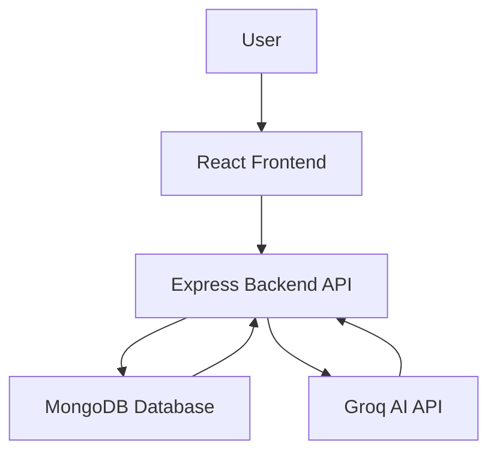

 # SkillPath AI

## AI-Powered Personalized Learning Platform

SkillPath AI is a full-stack MERN application that provides personalized learning experiences using Artificial Intelligence. The platform helps learners transform a simple goal (such as **"Become a React Developer"**) into a structured 12-week roadmap tailored to their skill level and weekly study schedule.

In addition to roadmap generation, the platform offers an AI-powered doubt assistant, project recommendations, progress tracking, and secure user authentication.

---

## Features

### AI Roadmap Generator

Generate personalized 12-week learning roadmaps based on:

* Learning Goal
* Current Skill Level
* Weekly Study Hours

Roadmaps are generated using the Groq API and stored in MongoDB for future access.

### AI Doubt Assistant

A built-in AI tutor that helps users by:

* Answering programming questions
* Explaining concepts
* Providing code examples
* Supporting follow-up conversations
* Acting as a 24/7 learning assistant

### AI Project Recommendations

Receive personalized project ideas based on your current skill level.

Each recommendation includes:

* Project Title
* Description
* Suggested Technologies
* Reason for Recommendation

### Progress Dashboard

Track learning progress through:

* Roadmap completion
* Progress bars
* Learning streaks
* Completion percentage
* Curated learning resources

### Authentication

* User Registration
* User Login
* JWT Authentication
* Password Hashing (bcrypt)
* Protected Routes

---

## Technology Stack

| Layer           | Technologies                                                 |
| --------------- | ------------------------------------------------------------ |
| Frontend        | React.js, Vite, Axios, Context API, Tailwind CSS / Bootstrap |
| Backend         | Node.js, Express.js                                          |
| Database        | MongoDB, Mongoose                                            |
| Authentication  | JWT, bcrypt                                                  |
| AI              | Groq API                                                     |
| Version Control | Git, GitHub                                                  |

---

## System Architecture



---

## Project Structure

```text
skillpath-ai/
│
├── frontend/
│   ├── src/
│   │   ├── components/
│   │   │   ├── layout/
│   │   │   ├── landing/
│   │   │   ├── dashboard/
│   │   │   └── ui/
│   │   ├── pages/
│   │   ├── hooks/
│   │   ├── services/
│   │   └── context/
│   └── package.json
│
├── backend/
│   ├── routes/
│   ├── controllers/
│   ├── models/
│   ├── middleware/
│   ├── config/
│   └── server.js
│
└── README.md
```

---

## Database Models

### User

* Name
* Email
* Password
* Skill Preferences
* Progress
* Learning Streak

### Roadmap

* User ID
* Learning Goal
* Skill Level
* Weekly Hours
* 12-Week Plan
* Completion Status

### Chat

* User ID
* Messages
* Timestamps
* Conversation Context

### Resource

* Title
* Category
* Link
* Admin Metadata

---

## Application Workflow

1. User registers or logs in.
2. User enters a learning goal.
3. User selects skill level and study hours.
4. AI generates a personalized roadmap.
5. Roadmap is saved to MongoDB.
6. User tracks learning progress.
7. AI answers learning-related questions.
8. AI recommends projects.
9. Dashboard displays overall progress.

---

## Example Use Case

**Goal:** Become a React Developer

**Skill Level:** Beginner

**Weekly Hours:** 8 Hours

Generated roadmap includes:

* HTML
* CSS
* JavaScript
* React Fundamentals
* Components
* Hooks
* Routing
* API Integration
* Projects
* Portfolio Preparation

---

## Future Enhancements

* Voice-based AI Tutor
* Video Course Recommendations
* Peer Learning Community
* Gamification
* Mobile Application
* Admin Analytics Dashboard
* Multi-language Roadmaps
* AI Resume & Portfolio Feedback

---

## Conclusion

SkillPath AI demonstrates the integration of Artificial Intelligence with full-stack web development to create a personalized and engaging learning platform. It combines MERN technologies with AI-powered features to improve learning efficiency and user engagement.

---

## Author

**Project Name:** SkillPath AI

**Type:** Full-Stack AI Web Application


